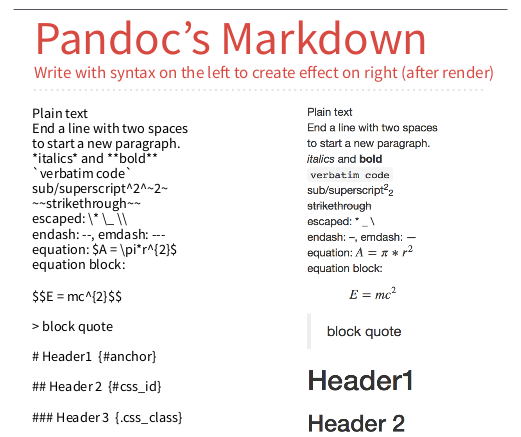
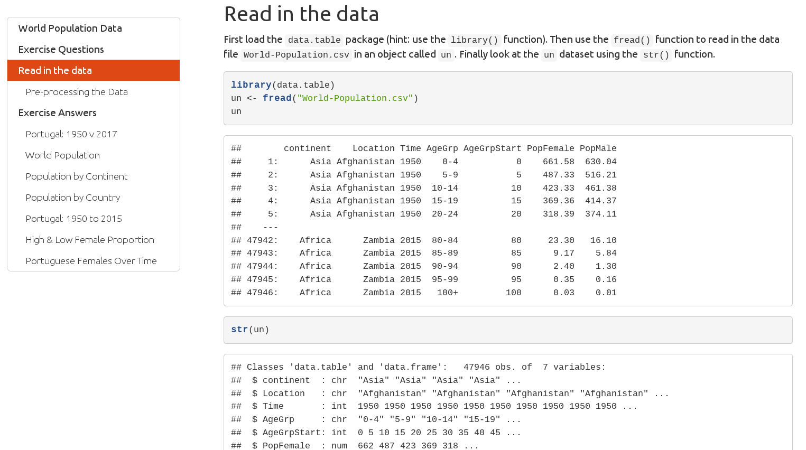
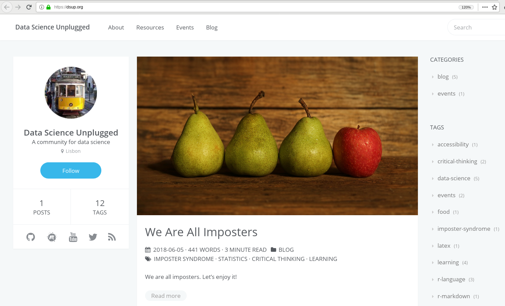
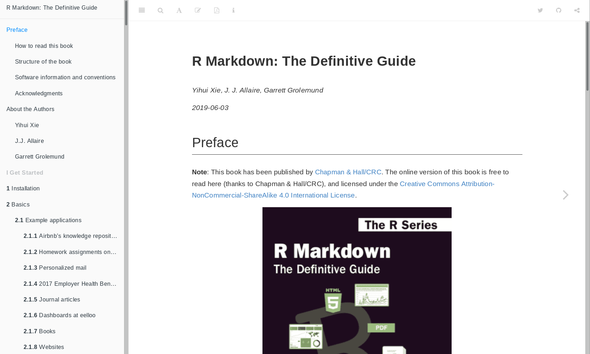
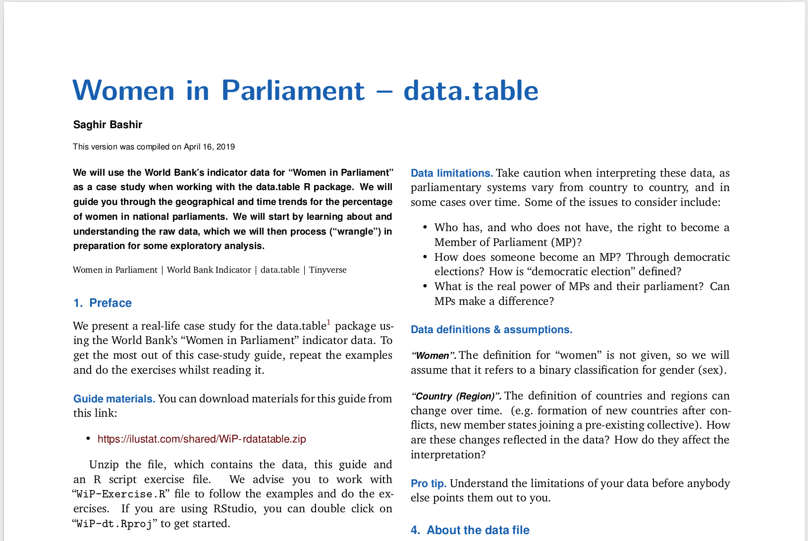
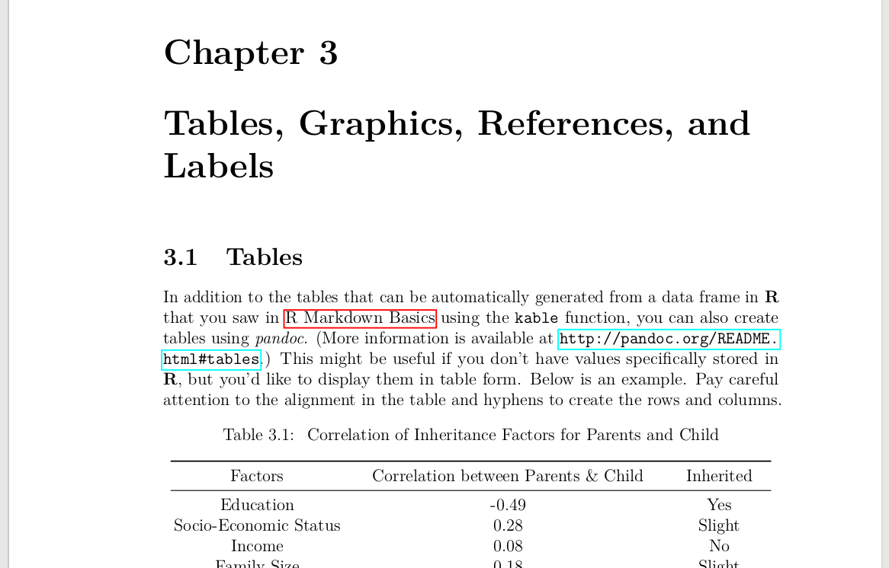
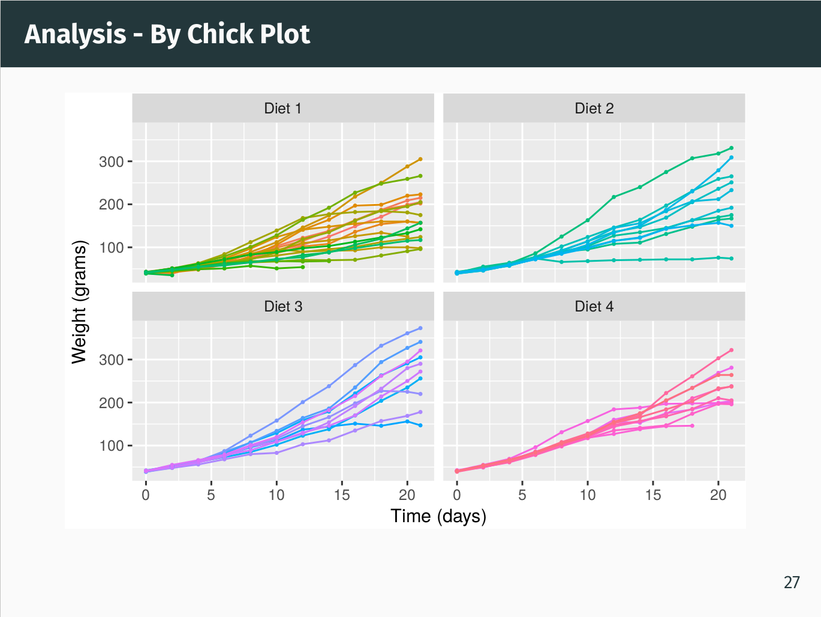
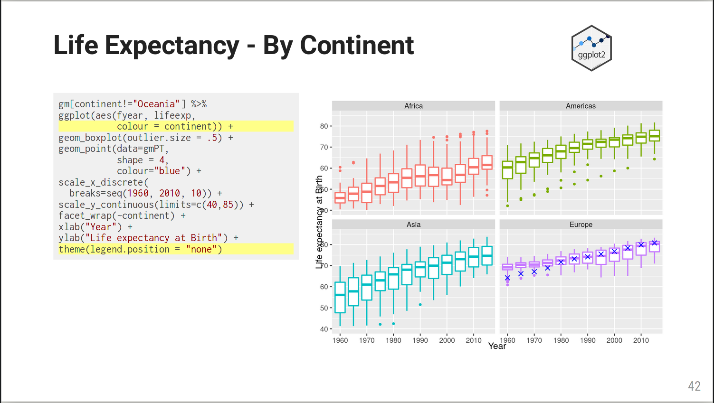

```{r setup, include=FALSE}
library(here)
library(knitr)
library(kableExtra)

# Copied & modified from: https://github.com/gadenbuie/gentle-ggplot2 (Index.Rmd)
#
# Thanks to Garrick Aden-Buie (https://www.garrickadenbuie.com/) for sharing :)
#

knitr::opts_chunk$set(fig.width=4.4, fig.height=3.2, fig.retina=4,
                      out.width = "100%",
                      message=FALSE, warning=FALSE, cache = FALSE, 
                      autodep = TRUE, hiline=TRUE)

knitr::opts_hooks$set(fig.callout = function(options) {
  if (options$fig.callout) {
    options$echo <- FALSE
    options$out.height <- "99%"
    options$fig.width <- 16
    options$fig.height <- 8
  }
  options
})

options(
  htmltools.dir.version = FALSE, 
  width = 90,
  # max.print = 9999,
  knitr.table.format = "html"
)

```

class: middle, center

<div class="rlogo-left-top"></div> 
<div class="Rmarkdown-hex-right-top"></div> 

&nbsp;

<br>

# Introduction to R Markdown

<br>

### Jean-Baptiste Lecomte<br><br>September 2019

<br>

<!-- https://github.com/saghirb/Rmarkdown-Intro-Workshop -->

---
class: inverse, center, middle

<div class="Rmarkdown-hex-right-top"></div> 

# What is R Markdown?

---
<div class="Rmarkdown-hex-right-top"></div> 

.center[# What is Markdown?]

<br>

## Special computer language ("Markup")

### &nbsp;&nbsp;&nbsp; - Plain text file with special syntax.

### &nbsp;&nbsp;&nbsp; - Human readable.

### &nbsp;&nbsp;&nbsp; - "Tags" define Structure & elements.

### &nbsp;&nbsp;&nbsp; - Converts to HTML, PDF, ...

---
<div class="Rmarkdown-hex-right-top"></div> 

.center[# Markdown Example]

.pull-left[
```
# Markdown Example

Paragraphs are separated by a blank line.

## Format text

Some _italic_, **bold** and `monospace` text.

Bullet list
+ Apples.
+ Oranges.
+ Pears

An [example link](https://github.com/saghirb)..
```
]
--
.pull-right[
### Markdown Example

Paragraphs are separated by a blank line.

#### Format text

Some _italic_, **bold** and `monospace` text.

Bullet list
+ Apples.
+ Oranges.
+ Pears

An [example link](https://github.com/saghirb).
]


---
<div class="Rmarkdown-hex-right-top"></div> 

.center[# What is R Markdown?]

<br>

## A mix of R programming and markdown.

### &nbsp;&nbsp;&nbsp; - R code and documentation in one place.

### &nbsp;&nbsp;&nbsp; - Great for doing reproducible research.

### &nbsp;&nbsp;&nbsp; - Great for collaborating and sharing.

### &nbsp;&nbsp;&nbsp; - Converts to HTML, PDF, websites, article, books, ...


---
<div class="Rmarkdown-hex-right-top"></div> 

.center[# R Markdown Example]

.pull-left[
```{r comment=NA, echo=FALSE}
cat('--- 
title: "R Markdown Demo"
author: "Saghir Bashir"
date: "13/06/2019"
output: html_document
---\n\n_Using_  **R** as a calculator.\n\n```{r Rcalc}
2+5
8**2\n```
\nPlot the `ChickWeight` data.\n```{r plotCW, echo=FALSE, out.width="80%"}
with(ChickWeight, boxplot(weight ~ Time))\n```')
```

]
--
.pull-right[
_Using_  **R** as a calculator.

```{r Rcalc}
(2+5)**2
```

Plot the `ChickWeight` data.

```{r plotCW, echo=FALSE, out.width="80%"}
with(ChickWeight, boxplot(weight ~ Time))
```
]

---
<div class="Rmarkdown-hex-right-top"></div> 

.center[# R Markdown Explained - YAML]

.pull-left[
```{r comment=NA, echo=FALSE, highlight.output=c(1:6)}
cat('--- 
title: "R Markdown Demo"
author: "Saghir Bashir"
date: "13/06/2019"
output: html_document
---\n\n_Using_  **R** as a calculator.\n\n```{r Rcalc}
2+5
8**2\n```
\nPlot the `ChickWeight` data.\n\n```{r plotCW, echo=FALSE, out.width="80%"}
with(ChickWeight, boxplot(weight ~ Time))\n```')
```
]

.pull-right[
## File extension is `.Rmd`

### &nbsp;&nbsp;&nbsp; - e.g. `My-Report.Rmd`

## Top is YAML header

### &nbsp;&nbsp;&nbsp; - Descriptive information.

### &nbsp;&nbsp;&nbsp; - Format & Style.
]

---
<div class="Rmarkdown-hex-right-top"></div> 

.center[# R Markdown Explained - Markdown]

.pull-left[
```{r comment=NA, echo=FALSE, highlight.output=c(8, 15)}
cat('--- 
title: "R Markdown Demo"
author: "Saghir Bashir"
date: "13/06/2019"
output: html_document
---\n\n_Using_  **R** as a calculator.\n\n```{r Rcalc}
2+5
8**2\n```
\nPlot the `ChickWeight` data.\n\n```{r plotCW, echo=FALSE, out.width="80%"}
with(ChickWeight, boxplot(weight ~ Time))\n```\n')
```
]

.pull-right[
## Below the YAML header

### - Markdown code.

]

---
<div class="Rmarkdown-hex-right-top"></div> 

.center[# R Markdown Explained - R Chunks]

.pull-left[
```{r comment=NA, echo=FALSE, highlight.output=c(10:13, 17, 18)}
cat('--- 
title: "R Markdown Demo"
author: "Saghir Bashir"
date: "13/06/2019"
output: html_document
---\n\n_Using_  **R** as a calculator.\n\n```{r Rcalc}
2+5
8**2\n```\n\nPlot the `ChickWeight` data.\n\n```{r plotCW, echo=FALSE, out.width="80%"}
with(ChickWeight, boxplot(weight ~ Time))\n```\n')
```
]

.pull-right[
## Below the YAML header

### - Markdown code.

### - R code chunks with:

### &nbsp;&nbsp;&nbsp; - unique names.

### &nbsp;&nbsp;&nbsp; - chunk options.
]
---
class: inverse, center, middle

<div class="Rmarkdown-hex-right-top"></div> 

# Practice !

---
class: inverse

<div class="Rmarkdown-hex-right-top"></div> 

# R Markdown Cheatsheet

.left-plot[
```{r RmdCheatSheet, echo=FALSE, out.width="90%"}

```
]
.right-plot[
### - Useful to find R markdown "tags".

### - Use it for the exercises.

### - Lots of other useful information too.

<br><br>

**Source: https://www.rstudio.com/resources/cheatsheets/**
]

---
class: inverse

<div class="Rmarkdown-hex-right-top"></div> 

# Summary

## R Markdown

### &nbsp;&nbsp;&nbsp; - R code and documentation in one place.

### &nbsp;&nbsp;&nbsp; - Great for doing reproducible research.

### &nbsp;&nbsp;&nbsp; - Great for collaborating and sharing.

### &nbsp;&nbsp;&nbsp; - A big range of possible outputs.

### &nbsp;&nbsp;&nbsp; - The rewards and benefits are big!


---
class: inverse, center, middle

<div class="Rmarkdown-hex-right-top"></div> 

# R Markdown Examples

---
class: center
<div class="Rmarkdown-hex-right-top"></div> 

# HTML "Analysis" Document

```{r eg-HTML-01, echo=FALSE, out.width="80%"}

```

---
class: center
<div class="Rmarkdown-hex-right-top"></div> 
<div class="blogdown-left-top"></div> 

# HTML Website

```{r eg-HTML-02, echo=FALSE, out.width="80%"}

```

---
class: center
<div class="Rmarkdown-hex-right-top"></div> 
<div class="bookdown-left-top"></div> 

# HTML Book

```{r eg-HTML-03, echo=FALSE, out.width="80%"}

```

---
class: center
<div class="Rmarkdown-hex-right-top"></div> 

# PDF Article

```{r eg-PDF-01, echo=FALSE, out.width="70%"}

```

---
class: center
<div class="Rmarkdown-hex-right-top"></div> 
<div class="bookdown-left-top"></div> 

# PDF Book

```{r eg-PDF-02, echo=FALSE, out.width="70%"}

```

---
class: center
<div class="Rmarkdown-hex-right-top"></div> 

# PDF Presentation

```{r eg-PDF-03, echo=FALSE, out.width="65%"}

```

---
class: center
<div class="Rmarkdown-hex-right-top"></div> 
<div class="xaringan-hex-left-top"></div> 

# HTML Presentation

```{r eg-HTML-04, echo=FALSE, out.width="80%"}

```

---
<div class="Rmarkdown-hex-right-top"></div> 

.center[# More R Markdown]

.pull-left[
## Formats

### &nbsp;&nbsp;&nbsp; - HTML

### &nbsp;&nbsp;&nbsp; - PDF

### &nbsp;&nbsp;&nbsp; - Word & ODF 

### &nbsp;&nbsp;&nbsp; - Power Point & ODF
]

.pull-right[
## Other

### &nbsp;&nbsp;&nbsp; - Dashboards

### &nbsp;&nbsp;&nbsp; - Web Applications

### &nbsp;&nbsp;&nbsp; - HTML Notebooks

### &nbsp;&nbsp;&nbsp; - CVs
]


---
class: inverse, center, middle

## This work is based on the workshop written by Saghir Bashir

## Available at

## https://github.com/saghirb/Rmarkdown-Intro-Workshop


